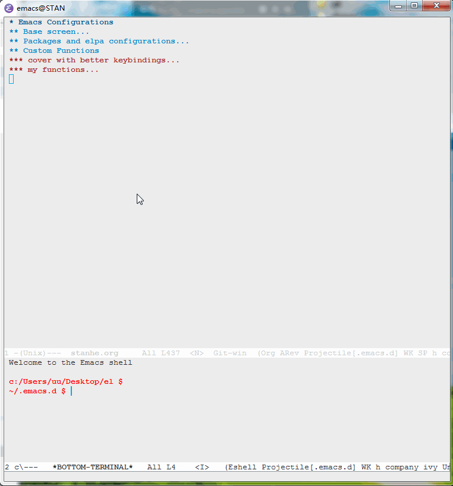
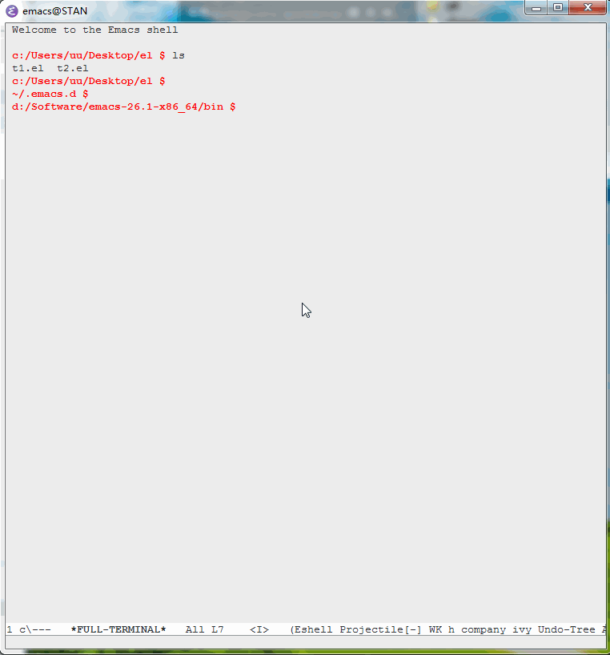

# pop-eshell-mode

I want a terminal work fine on win,and act as some IDE side menu. 
the same time ,i want run some commands in a full screen window,and i can fast access to it,so i made this.

## Install

1. git-bash: "c:/Users/$your_name/AppData/Roaming/.emacs.d"

```
git clone https://github.com/stanhe/pop-eshell.git
```

2. add below code in your init.el

```
(add-to-list 'load-path "~/.emacs.d/pop-eshell")
(require 'pop-eshell-mode)
(pop-eshell-mode 1)
```

## Usage

|key |fuction|
|-|-|
|C-c C-e C-e |eshell-pop-toggle|
|C-c C-e C-f |fast-eshell-pop|


## Screenshots 

|bottom-side |full-screen |
|:------:|:------:|
|||
