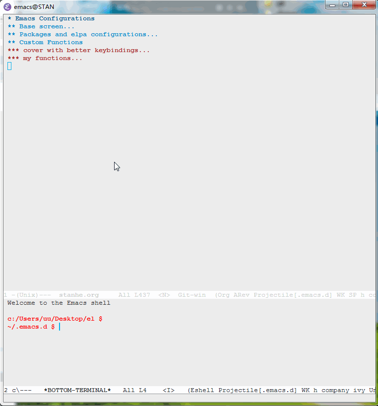
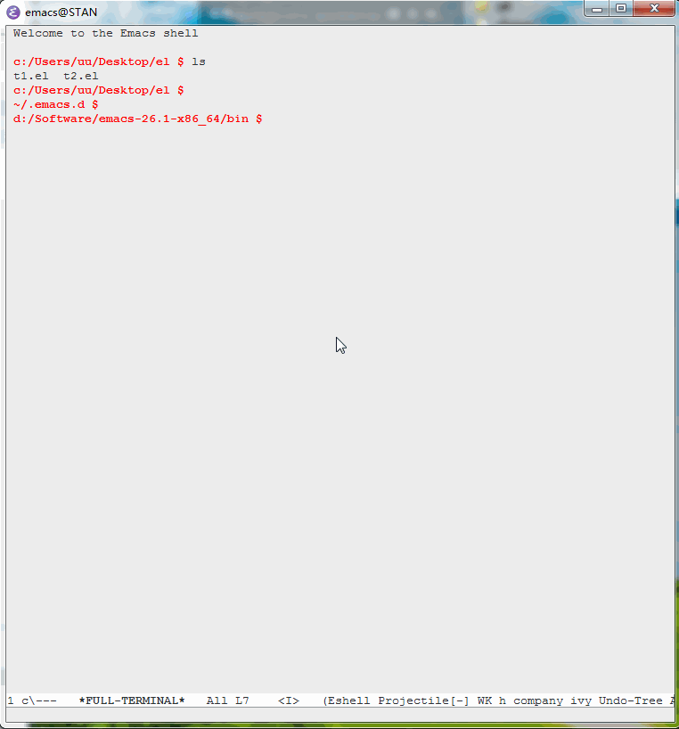
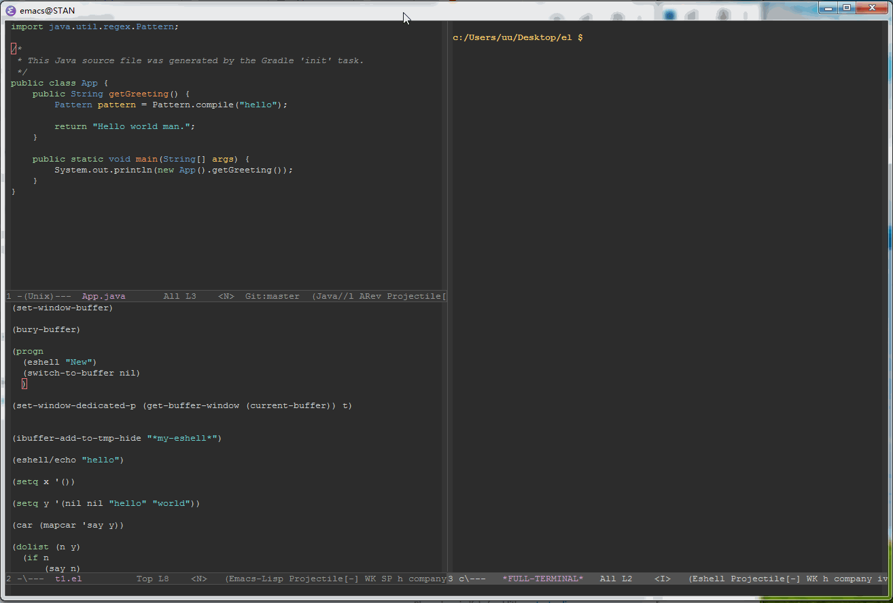

# pop-eshell-mode

IDE-like popup terminal workflows for Emacs `eshell`, with a bottom terminal drawer and a fast fullscreen terminal switch.

`pop-eshell-mode` adds two terminal workflows on top of Emacs `eshell`:

- A bottom popup terminal that behaves like the terminal drawer in modern IDEs.
- A fullscreen terminal that you can jump to quickly for project-level command work.

The package is lightweight, works well for multi-window workflows, and is especially useful if you want a terminal experience closer to IDEs without leaving `eshell`.

## Why This Project Exists

I built `pop-eshell-mode` because I could not find a lightweight Emacs package that gave `eshell` an IDE-style bottom popup terminal workflow. The gap was especially noticeable in my Windows workflow, where I wanted a terminal that was easy to show, hide, and reuse across editing sessions.

This project exists to make `eshell` feel faster and more practical for day-to-day development by combining:

- A bottom popup terminal for quick command access.
- A fullscreen terminal for focused command sessions.
- Project-root aware directory switching for common development workflows.

## Features

- Bottom popup `eshell` window.
- Fast toggle between the current buffer and a fullscreen terminal.
- Project root detection using configurable marker files.
- Support for multi-window workflows.
- Optional prefix behavior to open the fullscreen terminal in the current file directory.

## Installation

Clone the repository into your Emacs configuration directory:

```bash
git clone https://github.com/stanhe/pop-eshell.git ~/.emacs.d/pop-eshell
```

Add the following to your `init.el`:

```elisp
(add-to-list 'load-path "~/.emacs.d/pop-eshell")
(require 'pop-eshell-mode)

;; Use these files to detect a project root.
(setq pop-find-parent-directory '(".git" "gradlew"))

(pop-eshell-mode 1)
```

## Usage

| Key | Command | Description |
| --- | --- | --- |
| `C-c C-e C-e` | `eshell-pop-toggle` | Show or hide the bottom popup terminal. |
| `C-c C-e C-f` | `fast-eshell-pop` | Jump to the fullscreen terminal or back to the previous buffer. |

### Fullscreen Terminal Behavior

- By default, `fast-eshell-pop` opens in the detected project root.
- With a prefix argument, it opens in the current buffer's directory instead.

## Configuration

### `pop-find-parent-directory`

A list of marker files or directories used to detect the project root.

Example:

```elisp
(setq pop-find-parent-directory '(".git" "gradlew" "package.json"))
```

## Screenshots

### Single window

| Bottom terminal | Fullscreen terminal |
| :---: | :---: |
|  |  |

### Multi-window



## Roadmap

- Improve package metadata and MELPA-readiness.
- Add automated tests for buffer and window behavior.
- Improve documentation for different operating system workflows.

## License

This repository does not currently include a separate license file. If you intend to distribute or package it more broadly, adding one should be the next step.
